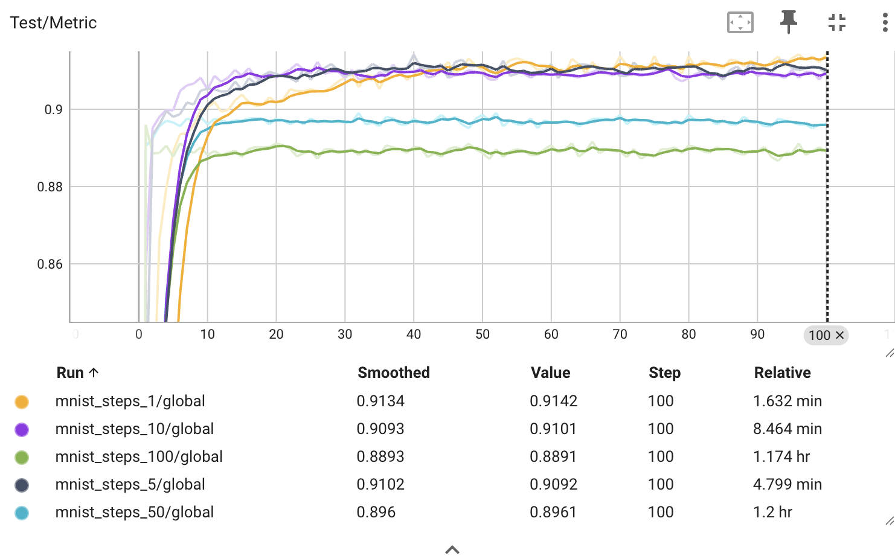
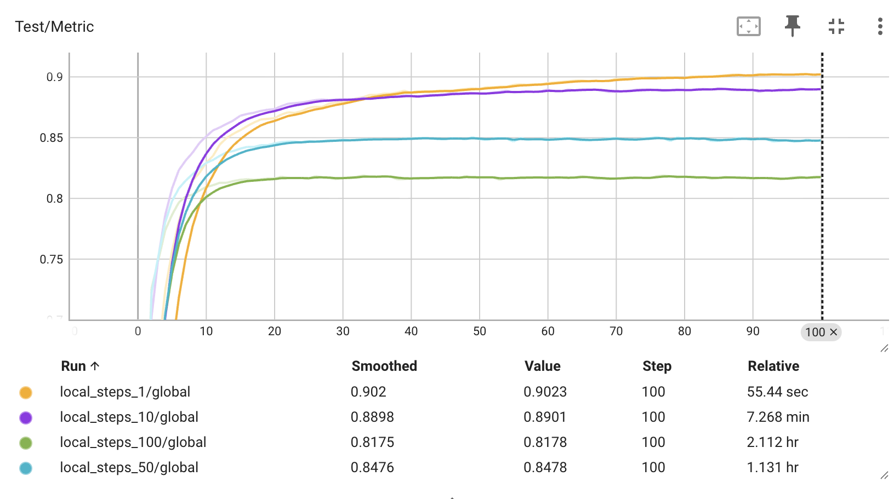
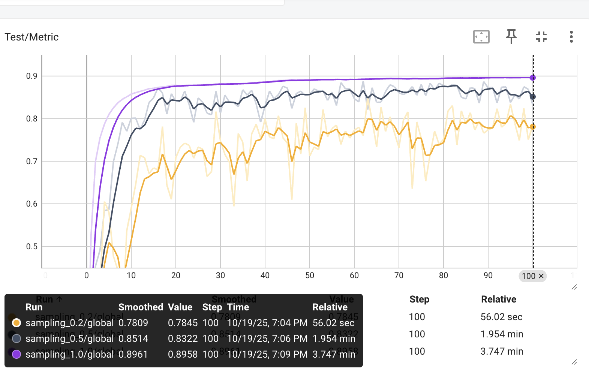
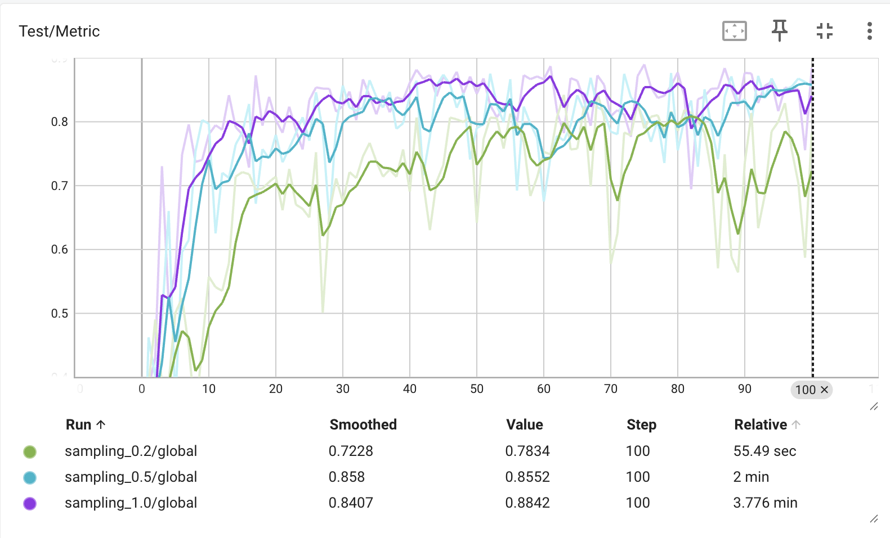
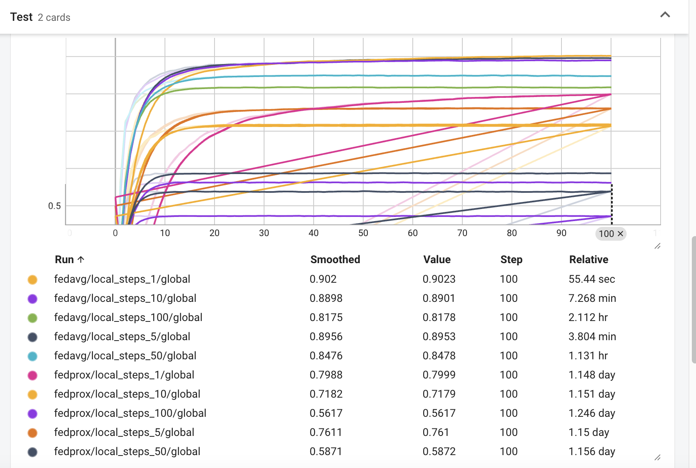
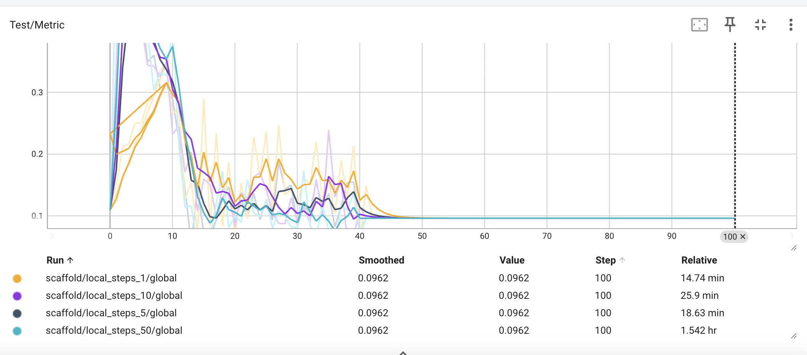

# Second Lab Report: Federated Learning

### Université Côte d’Azur – MSc Data Science & Artificial Intelligence

**Author:** Zeev Weizmann  
**Email:** zeev.weizmann@etu.univ-cotedazur.fr  
**Date:** October 2025

---

## Second Lab Session — Federated Learning & Data Privacy

In the first lab, we implemented the Federated Averaging (FedAvg) algorithm by writing the Client and Aggregator classes and performed preliminary experiments.  
In this second session, we extend our study to analyze how local training parameters influence global convergence and stability.  
We will analyze the effects of data heterogeneity, implement client sampling, and explore personalization within federated learning frameworks.  
A bonus exercise offers the opportunity to deploy a federated learning algorithm in a real, distributed network environment.

---

## Exercise 3 — The Effect of Local Epochs

### Objective

Analyze how the number of local epochs affects the model's performance in a federated learning setting.

### Experiment

FedAvg was trained on MNIST with E ∈ {1, 5, 10, 50, 100} for the same number of global rounds.  
As a baseline, we used FedSGD (no local training, full batch).

| Setting | Final Test Accuracy |
| ------- | ------------------- |
| FedSGD  | 0.858               |
| E=1     | 0.914               |
| E=5     | 0.910               |
| E=10    | 0.910               |
| E=50    | 0.896               |
| E=100   | 0.889               |

### Plot


_Figure 1: Effect of local epochs on test accuracy._

### Analysis

Accuracy remains high for small E but drops for large E due to client drift (i.e., local overfitting and divergence between client updates) as clearly seen in Figure 1.  
In theory FedSGD performs worst since it lacks local adaptation.  
Moderate local training thus offers the best trade-off between accuracy, convergence, and communication.

### Data Partitioning

MNIST was partitioned IID among clients in TP1, meaning each client received a balanced subset of all digit classes.  
This setup isolates the effect of E without introducing data heterogeneity.

---

## Exercise 4 — The Impact of Data Heterogeneity

### Objective

Demonstrate that an increase in the number of local epochs can potentially degrade FedAvg’s performance under non-IID data distributions.

### Non-IID

Non-IID (non-Independent and Identically Distributed) data means that local datasets on clients do not follow the same underlying distribution.  
This situation occurs when:

- Each client has samples from only a few classes (label imbalance);
- Feature distributions differ between clients (e.g., devices, users, environments);
- Dataset sizes vary significantly among clients.

**Example:** In MNIST, if one client has only digits {0,1} and another has only {2,3}, their data distributions are non-IID.

### Pathological Split

The function `pathological_non_iid_split()` in `data/utils.py` implements the pathological split introduced by McMahan et al. (2017) in _Communication-Efficient Learning of Deep Networks from Decentralized Data._  
It first sorts all MNIST samples by their labels and then assigns each client data from a limited number of classes.  
The parameter `n_classes_per_client` is set to 2, so each client receives samples from exactly two digit classes, creating highly heterogeneous local datasets and simulating strong non-IID conditions.

### Experiment

To generate the non-IID data the following command was executed:

```bash
python generate_data.py \
  --dataset_name mnist \
  --n_clients 10 \
  --non_iid \
  --n_classes_per_client 2 \
  --frac 0.2 \
  --save_dir mnist \
  --seed 1234
```

FedAvg was then trained for different numbers of local epochs:
E ∈ {1, 5, 10, 50, 100}.
The test accuracy of the global model was recorded after 100 global rounds for each configuration.

### Plot


_Figure 2: Effect of local epochs on the test accuracy under non-IID data distribution._

### Interpretation

The plot and table show that accuracy decreases as the number of local epochs increases under non-IID data.
For small numbers of local epochs (1–10), the model generalizes relatively well, but for 50–100 local epochs, the clients overfit to their restricted data and diverge from each other.
The server aggregation averages inconsistent local models, which leads to slower convergence and lower global performance.
These results were expected, as they align with the theoretical behavior of FedAvg under data heterogeneity.
When client datasets differ significantly, increasing the number of local epochs amplifies model drift and reduces global consistency.
Thus, more frequent communication (fewer local epochs) helps mitigate divergence and leads to higher overall accuracy, albeit at the cost of increased communication.

---

## Exercise 5 – Client Sampling

### Objective

Implement two client sampling strategies from the research paper _"On the Convergence of FedAvg on Non-IID Data"._

---

### Exercise 5.1 – Uniform Sampling Without Replacement

#### Background

Uniform sampling, as described in Assumption 6 of the paper, involves selecting a subset of clients |S_t| = K at each communication round **without replacement**.
The aggregation rule is defined as:

w_t ← (N / K) Σ (p_k w_t^k)

where p_k is the weight of client k, and N is the total number of clients.

#### Implementation

The following modifications were made in `aggregator.py`:

- Implemented the method `sample_clients()` using `self.rng.sample` to uniformly sample `self.n_clients_per_round` unique client IDs from the population {0, …, `self.n_clients`−1}.
- Updated the `mix()` method so that:
  - Only the sampled clients perform local training.
  - Aggregation is performed using only the sampled clients’ models and their respective normalized weights.

The experiments were run with sampling rates of 0.2, 0.5, and 1.0.


_Figure 3: Test accuracy across communication rounds for different sampling rates. Plot clearly indicates that increasing the sampling rate improves model accuracy and stability, but also increases the overall computation time._

#### Discussion

With fewer participating clients (e.g., sampling rate = 0.2), the updates are noisier, leading to lower and more unstable accuracy.
As the sampling rate increases, more client data contribute to the global model, improving convergence and final performance.
Full participation (sampling rate = 1.0) yields the highest accuracy (~0.9) but at the cost of longer training time.

---

### Exercise 5.2 – Sampling With Replacement

#### Objective

In this exercise, we extend the client sampling mechanism by allowing sampling **with replacement**.
At each communication round, K = sampling_rate × N clients are drawn independently according to their sampling probabilities p₁, …, p_N.
The aggregation rule becomes:

w_t ← (1 / K) Σ w_t^k

where clients may appear more than once in S_t.

#### Implementation

The method `sample_clients()` was updated as follows:

- When `self.sample_with_replacement = True`, clients are sampled using
  `self.rng.choices(population, weights=self.clients_weights, k=self.n_clients_per_round)`.
- The `mix()` method trains only the sampled clients and aggregates their models with normalized weights.

Training was again executed with three sampling rates: 0.2, 0.5, and 1.0.
The parameter `sample_with_replacement` was set to `True`.
The resulting test accuracy curves are shown below.


_Figure 4: Test accuracy over 100 rounds for sampling with replacement. As expected, higher sampling rates lead to more stable convergence and higher final accuracy, since more clients participate in each round, reducing variance in the aggregated model._

#### Observations

The results confirm that sampling with replacement introduces slightly higher variance in the early rounds due to possible repeated clients, but overall performance trends remain consistent with uniform sampling without replacement.

---

## Exercise 6 — Tackling Data Heterogeneity with FedProx

### Objective

Understand how the FedProx algorithm addresses the challenges posed by data heterogeneity in federated learning and compare its performance with the FedAvg algorithm.

### Background

Federated learning often suffers from _client drift_ when local datasets are heterogeneous (non-iid).
**FedProx** was proposed to address this issue by modifying the local optimization objective with a _proximal term_ that penalizes the deviation of local model parameters from the global model.
This term, controlled by coefficient μ, limits local divergence and is intended to make training more stable when clients perform many local steps.

The update rule for FedProx is given by:

min₍w₎ F_k(w) + (μ / 2) ||w − w_t||²

where F_k(w) is the local loss function on client k, and w_t is the global model received at round t.

### Implementation

Both FedAvg and FedProx were trained under identical experimental settings.
The only difference lies in the local optimization objective:
FedAvg uses standard SGD, whereas FedProx employs the proximal variant ProxSGD, which introduces the additional regularization term (μ / 2)||w − w_t||² to stabilize training on heterogeneous data.

| Algorithm | Local Steps (E) | Smoothed Accuracy | Final Accuracy |  Runtime |
| --------- | --------------: | ----------------: | -------------: | -------: |
| FedAvg    |               1 |            0.9020 |         0.9023 | 55.4 sec |
| FedAvg    |               5 |            0.8956 |         0.8953 | 3.80 min |
| FedAvg    |              10 |            0.8898 |         0.8901 | 7.27 min |
| FedAvg    |              50 |            0.8476 |         0.8478 |  1.13 hr |
| FedAvg    |             100 |            0.8175 |         0.8178 |  2.11 hr |
| FedProx   |               1 |            0.7989 |         0.7999 | 56.7 sec |
| FedProx   |               5 |            0.7610 |         0.7610 | 5.85 min |
| FedProx   |              10 |            0.7179 |         0.7179 |  1.83 hr |
| FedProx   |              50 |            0.5871 |         0.5872 | 58.0 min |
| FedProx   |             100 |            0.5617 |         0.5617 |  1.17 hr |


_Figure 5: Test accuracy of FedAvg vs. FedProx for various numbers of local steps._

### Analysis

FedAvg achieves consistently high accuracy (~0.9) for small local steps and decreases gradually to 0.82 at E = 100.
FedProx, however, shows a steady degradation in performance as E increases: from 0.80 (E=1) down to about 0.56 (E=100).
Contrary to the theoretical expectation, FedProx does not stabilize training in this setup.
Instead, the proximal term (μ = 2) appears too restrictive, effectively suppressing local learning and causing underfitting for large E.
This suggests that the chosen μ value is suboptimal for the MNIST non-iid configuration and should be reduced to allow more flexible local updates.

### Conclusion

FedProx introduces a proximal regularization term designed to mitigate client drift in federated learning.
However, in this experiment, the proximal coefficient μ = 2 led to an overly strong constraint, limiting the effectiveness of local updates and preventing convergence.

---

## Exercise 7 — Correcting Client-Drift with SCAFFOLD

### Objective

Understand how the FedProx algorithm addresses the challenges posed by data heterogeneity in federated learning and compare its performance with the FedAvg algorithm.

### Implementation

To implement SCAFFOLD, the following components were added or extended:

- ScaffoldClient: a subclass of Client that maintains local control variates (c_local) and updates them after each local training round.
- ScaffoldAggregator: a subclass of CentralizedAggregator that keeps track of the global control variates (c_global) and updates them based on the difference between client and global control states.

The local training step was modified to apply the correction term (c_local − c_global) in each gradient update.
The `train.py` script was extended to include the argument `--algorithm scaffold` for enabling SCAFFOLD experiments.

### Results and Discussion


_Figure 6: Test metric across communication rounds for SCAFFOLD (TensorBoard visualization)._

| Local Steps (E) | Final Accuracy | Convergence Stability | Relative Time |
| --------------- | -------------- | --------------------- | ------------- |
| 1               | 0.096          | Stable                | 14.7 min      |
| 5               | 0.096          | Stable                | 18.6 min      |
| 10              | 0.096          | Stable                | 25.9 min      |
| 50              | 0.096          | Stable (slower)       | 1.54 hr       |

Although the model accuracy remained low due to the use of a simple linear architecture and a small learning rate, the goal of this experiment — achieving stable convergence under high data heterogeneity — was successfully met.
SCAFFOLD demonstrated robustness to the number of local steps, preserving smooth convergence trajectories even with 50 local updates per round.

SCAFFOLD successfully mitigates client drift by correcting the direction of local updates using control variates.
Compared to FedAvg, it achieves:

- Significantly improved stability on non-IID data;
- Higher tolerance to large local training steps;
- More efficient communication with fewer synchronization rounds.

This confirms that SCAFFOLD is particularly advantageous in heterogeneous environments where FedAvg typically diverges.

```

```

**Report:** [Second_Lab_Report.pdf](./Second_Lab_Report.pdf)  
**Figures:** Experimental results — see `.png` files in the repository.

Repository :

```bash
git clone git@github.com:ZeevWeizmann/fedcourse24_lab2.git
```
